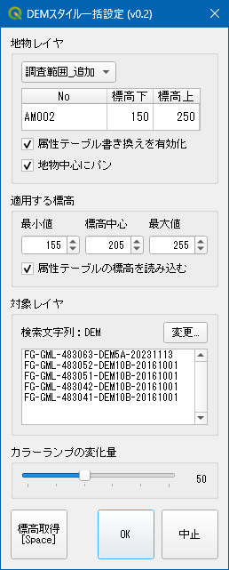

# DEMスタイル一括設定 / demstyle_all

地物毎にDEMスタイル（標高カラーマップ）を一括設定するツールです。
QGIS上で標高範囲を調整し、対象レイヤにまとめて反映できます。

## 対応環境

- QGIS 3.x

## 主な機能

- 標高自動取得および微調整機能による効率的な標高レンジ設定
  - キー操作（A-D、W-S）により標高および標高レンジを微調整できます。

- ベクタレイヤ（地物レイヤ）の属性テーブル連携機能
  - 地物毎の "標高上", "標高下" カラムの読み込み／書き出しに対応しています。

- 複数存在する標高レイヤへのスタイル一括適用
  - レイヤ名のキーワード検索により対象レイヤを指定できます。

## インストール（ZIP手動インストール）

1. [リリースノート](https://github.com/tamaohome/qgis-demstyle-all/releases) よりZIPをダウンロードして展開します。
2. 展開したフォルダを `demstyle_all` の名前でQGISプラグインディレクトリに配置します。
3. QGISを起動し、プラグイン管理画面で「DEMスタイル一括設定」を有効化します。
4. ツールバーまたはプラグインメニューから起動します。

## クイックスタート

1. DEMレイヤと地物レイヤを選択します。
2. 地物を選択し、標高の最小値・中心値・最大値を設定します。
3. データレンジスライダーで範囲を微調整します。
4. OKを押して、対象DEMレイヤへスタイルを適用します。

## 操作ヒント

- `W` / `S`: 中心標高を増減
- `A` / `D`: データレンジスライダーを左右に調整
- ダイアログは常に前面表示され、作業中のマップ操作と併用しやすい設計です

## ライセンス

[LICENSE](LICENSE) を参照してください。
